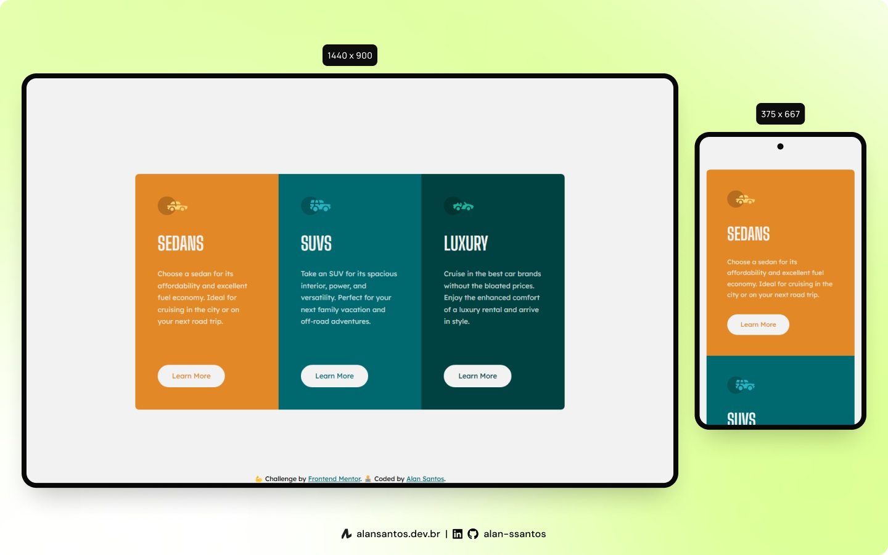

# Frontend Mentor - 3-column preview card component solution

This is a solution to the [3-column preview card component challenge on Frontend Mentor](https://www.frontendmentor.io/challenges/3column-preview-card-component-pH92eAR2).

## 📖 Table of contents

- [Overview](#overview)
  - [The challenge](#the-challenge)
  - [Screenshot](#screenshot)
  - [Links](#links)
- [My process](#my-process)
  - [Built with](#built-with)
  - [Useful resources](#useful-resources)
- [Author](#author)

## 🔎 Overview
### The challenge

Users should be able to:
- View the optimal layout depending on their device's screen size
- See hover states for interactive elements

### Screenshot

### Links

- Solution URL: [frontendmentor.io](https://www.frontendmentor.io/solutions/3column-preview-card-component-a6JSRcQYy)
- Live Site URL: [fmentor-3-column-preview-card.netlify.app](https://fmentor-3-column-preview-card.netlify.app/)

## 👨‍💻 My process

### Built with

- HTML5
- CSS
- VS Code

### Useful resources

- [WebAIM](https://webaim.org/techniques/css/invisiblecontent/#techniques) - This helped me to make `h1` visible only for screen readers.

## 🙋‍♂️ Author

- Website - [Alan Santos](https://www.alansantos.net)
- Frontend Mentor - [@alan-ssantos](https://www.frontendmentor.io/profile/alan-ssantos)
