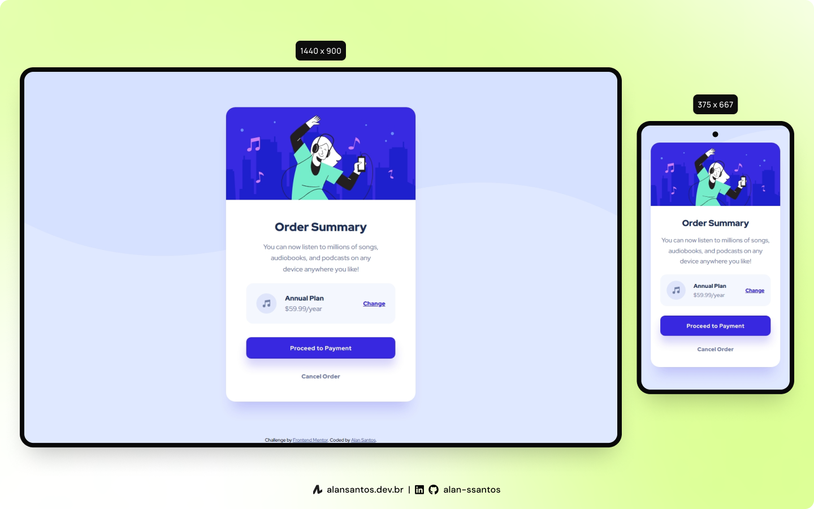

# Frontend Mentor - Order summary card solution

This is my solution to the [Order summary card challenge on Frontend Mentor](https://www.frontendmentor.io/challenges/order-summary-component-QlPmajDUj).

## 📖 Table of contents

- [Overview](#overview)
  - [The challenge](#the-challenge)
  - [Screenshot](#screenshot)
  - [Links](#links)
- [My process](#my-process)
  - [Built with](#built-with)
  - [Useful resources](#useful-resources)
- [Author](#author)

## 🔎 Overview
### The challenge

Users should be able to:
- See hover states for interactive elements

### Screenshot

### Links

- Solution URL: [frontendmentor.io](https://www.frontendmentor.io/solutions/order-summary-component-challenge-AGUtplkhw)
- Live Site URL: [fmentor-order-summary.netlify.app](https://fmentor-order-summary.netlify.app/)

## 👨‍💻 My process

### Built with

- Semantic HTML5 markup
- CSS custom properties
- Flexbox

### Useful resources

- [The A11Y Project](https://www.a11yproject.com/checklist/#global-code) - This helped me ensure the page is accessible.

## 🙋‍♂️ Author

- Website - [Alan Santos](https://www.alansantos.net)
- Frontend Mentor - [@alan-ssantos](https://www.frontendmentor.io/profile/alan-ssantos)
