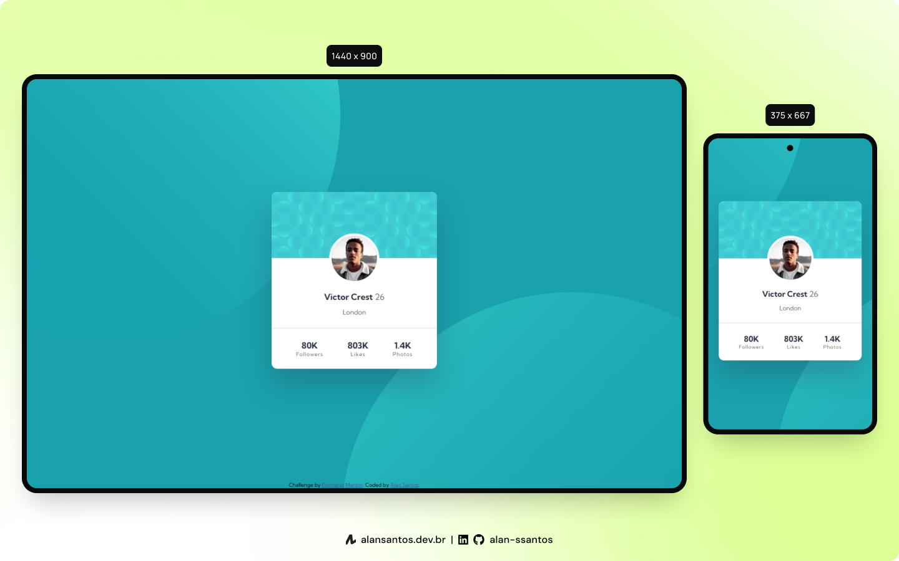

# Frontend Mentor - Profile card component solution

This is a solution to the [Profile card component challenge on Frontend Mentor](https://www.frontendmentor.io/challenges/profile-card-component-cfArpWshJ). Frontend Mentor challenges help you improve your coding skills by building realistic projects. 

## Table of contents

- [Overview](#overview)
  - [The challenge](#the-challenge)
  - [Screenshot](#screenshot)
  - [Links](#links)
- [My process](#my-process)
  - [Built with](#built-with)
  - [Useful resources](#useful-resources)
- [Author](#author)

## 🔎 Overview

### The challenge

- Build out the project to the designs provided

### Screenshot

### Links

- Solution URL: [frontendmentor.io](https://www.frontendmentor.io/solutions/profile-card-component-6Tf1FoQK7)
- Live Site URL: [alansantos.net](https://www.alansantos.net/frontendmentor-solutions/solutions/profile-card-component-main/)

## 👨‍💻 My process

### Built with

- Semantic HTML5 markup
- Vanilla CSS
- Flexbox
- VS Code

### Useful resources

- [MDN](https://developer.mozilla.org/en-US/docs/Web/CSS/background-position) - This helped me know how to position the background images.

## 🙋‍♂️ Author

- Website - [Alan Santos](https://www.alansantos.net)
- Frontend Mentor - [@alan-ssantos](https://www.frontendmentor.io/profile/alan-ssantos)
