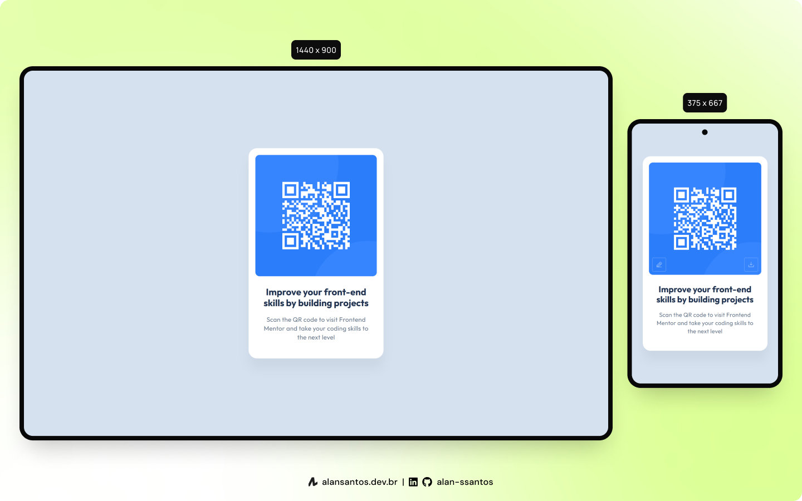

# Frontend Mentor | QR Code Component

This is a solution to the [QR Code Component on Frontend Mentor](https://www.frontendmentor.io/challenges/qr-code-component-iux_sIO_H). Frontend Mentor challenges help you improve your coding skills by building realistic projects.

## 📜 Table of contents

- [Overview](#overview)
  - [The challenge](#the-challenge)
  - [Screenshot](#screenshot)
  - [Links](#links)
- [My process](#my-process)
  - [Built with](#built-with)
  - [Useful resources](#useful-resources)
- [Author](#author)

## 🔎 Overview

### The challenge

- Build out the project to the designs provided

### Screenshot

### Links

- Solution URL: [frontendmentor.io](https://www.frontendmentor.io/solutions/qr-code-component-using-astro-react-and-tailwind-css-czHX9SfuIP)
- Live Site URL: [fmentor-qr-code-component.netlify.app](https://fmentor-qr-code-component.netlify.app/)

## 👨‍💻 My process

### Built with

- [Astro](https://astro.build/)
- [React](https://react.dev/)
- [Tailwind](https://tailwindcss.com/)
- [Hosted on Netlify](https://www.netlify.com/)

### Useful resources

- [qrcode.react](https://www.npmjs.com/package/qrcode.react) - Used to generate the QR code images
- [html-to-image](https://www.npmjs.com/package/html-to-image) - Used to save the QR code as PNG file

## 🙋‍♂️ Author

- Website - [Alan Santos](https://alansantos.dev.br/)
- Frontend Mentor - [@alan-ssantos](https://www.frontendmentor.io/profile/alan-ssantos)
