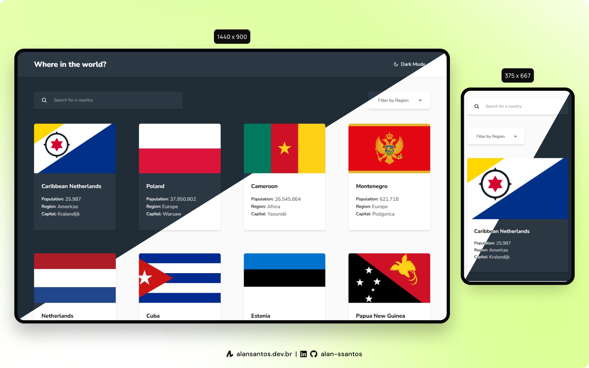

# Frontend Mentor | QR Code Component

This is my solution to the [REST Countries API with color theme switcher](https://www.frontendmentor.io/challenges/rest-countries-api-with-color-theme-switcher-5cacc469fec04111f7b848ca) using Astro, React and Tailwind CSS.

## 📜 Table of contents

- [Overview](#overview)
  - [The challenge](#the-challenge)
  - [Screenshot](#screenshot)
  - [Links](#links)
- [My process](#my-process)
  - [Built with](#built-with)
  - [Useful resources](#useful-resources)
- [Author](#author)

## 🔎 Overview

### The challenge

- Integrate the REST Countries API to pull country data and display it like in the designs

#### Users should be able to:

- See all countries from the API on the homepage ✅
- Search for a country using an input field ✅
- Filter countries by region ✅
- Click on a country to see more detailed information on a separate page ✅
- Click through to the border countries on the detail page ✅
- View the optimal layout for the interface depending on their device's screen size ✅
- See hover and focus states for all interactive elements on the page ✅
- Bonus: Toggle the color scheme between light and dark mode ✅

### Screenshot

### Links

- Solution URL: [frontendmentor.io](https://www.frontendmentor.io/solutions/rest-countries-astro-react-and-tailwind-css-sjLNaZiyAa)
- Live Site URL: [fmentor-rest-countries-api.netlify.app](https://fmentor-rest-countries-api.netlify.app/)

## 👨‍💻 My process

### Built with

- [Astro](https://astro.build/)
- [React](https://react.dev/)
- [Tailwind](https://tailwindcss.com/)
- [Hosted on Netlify](https://www.netlify.com/)

### Useful resources

- [REST Countries](https://restcountries.com/) - Information about countries via a RESTful API
- [react-icons](https://react-icons.github.io/react-icons/) - Icons

## 🙋‍♂️ Author

- Website - [Alan Santos](https://alansantos.dev.br/)
- Frontend Mentor - [@alan-ssantos](https://www.frontendmentor.io/profile/alan-ssantos)
